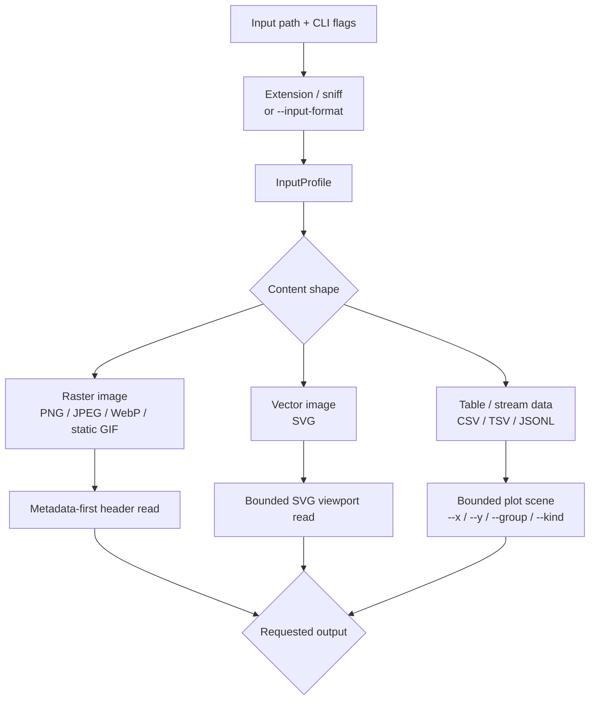
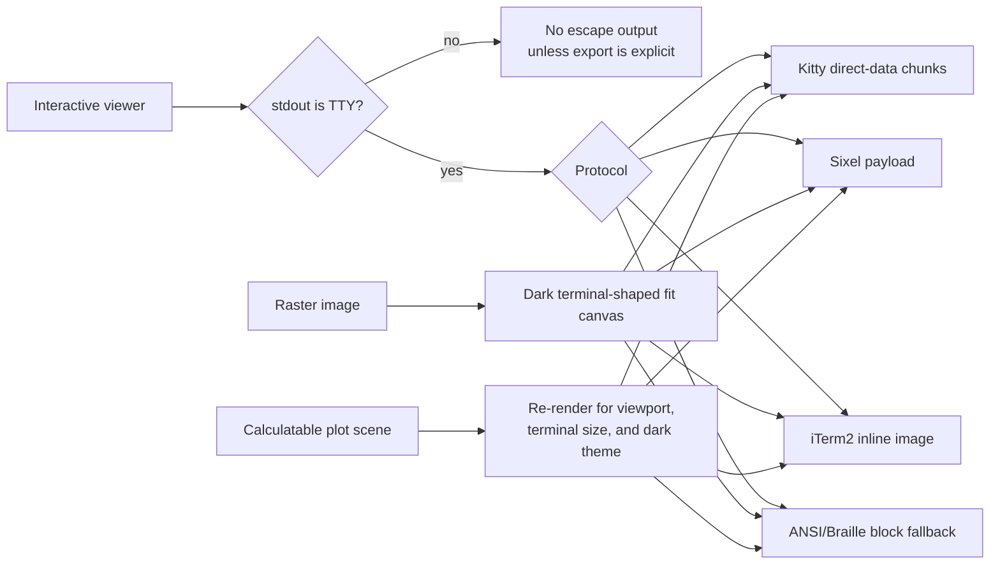
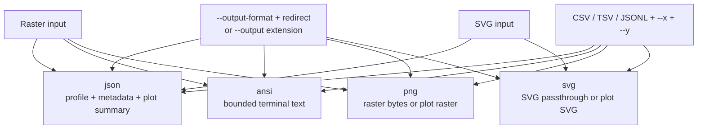

# termviz

Terminal-first viewing for images and plots.

`termviz` opens visual files from a shell, renders them in an interactive
terminal viewer when stdout is a TTY, and keeps redirected stdout scriptable for
metadata and explicit exports.

## Quick Start

```sh
termviz image.png
termviz image.png --inspect
termviz image.png --output-format ansi > preview.ansi
termviz image.png --output-format png > frame.png

termviz chart.svg
termviz chart.svg --output-format svg > chart.svg

termviz examples/latency-demo.csv --x time --y latency --group service
termviz examples/latency-demo.csv --x time --y latency --group service --output-format svg > latency.svg
termviz examples/latency-demo.csv --x time --y latency --group service --output-format png > latency.png
termviz examples/latency-demo.csv --x time --y latency --group service --output-format json > latency.json
```

If stdout is a terminal, the default command opens the viewer. If stdout is
redirected, `termviz` prints metadata or a clear error unless an explicit export
was requested; it does not accidentally dump terminal escape sequences into
scripts.

## Interactive Viewer

Common controls:

- `q`: quit
- `+` / `-`: zoom in and out
- `0`: fit to terminal
- arrow keys: pan
- `m`: toggle metadata or plot summary overlay
- left mouse drag: pan image inputs

Protocol selection:

```sh
termviz image.png --protocol auto
termviz image.png --protocol kitty
termviz image.png --protocol sixel
termviz image.png --protocol iterm
termviz image.png --protocol blocks
```

`auto` prefers known pixel-capable terminals such as Kitty, WezTerm, Ghostty,
iTerm2, and Sixel-capable terminals, then falls back to ANSI blocks. Terminal
multiplexers such as tmux and screen use blocks by default because image
passthrough support is configuration-dependent.

Kitty output uses remote-safe direct-data chunks, not local file-transfer
payloads, so it works in SSH, container, and sandboxed sessions where the
terminal process cannot read files from the app filesystem. Normal plot viewer
sizes render at the full terminal pixel estimate; only very large windows cap
the internal plot raster to keep redraws bounded.

## Export Modes

Use `--output-format` with shell redirection for deterministic, scriptable output:

- `json`: profile, metadata, and plot summaries
- `ansi`: terminal-cell preview output for raster and plot inputs
- `png`: PNG output for raster inputs and plot scenes
- `svg`: SVG passthrough for SVG inputs and SVG output for plot scenes

```sh
termviz image.png --output-format json > metadata.json
termviz image.png --output-format ansi > frame.ansi
termviz data.csv --x ts --y value --output-format svg > chart.svg
termviz data.csv --x ts --y value --output-format png > chart.png
```

Shell redirection does not expose the target filename to `termviz`, so
`termviz image.png > frame.ansi` cannot infer `ansi` from `frame.ansi`.
Use `--output-format` when writing to stdout or redirecting.

`--output path` is optional. It asks `termviz` to open the file itself and infer
the output format from `.json`, `.ansi`, `.ans`, `.png`, or `.svg`:

```sh
termviz image.png --output metadata.json
termviz data.csv --x ts --y value --output chart.svg
```

If an output extension is ambiguous or unsupported, `termviz` asks for
`--output-format json|ansi|png|svg` to force the output format.

Input format is inferred from extension and bounded content sniffing. Use
`--input-format` only when that inference is wrong or impossible:

```sh
termviz metrics.data --input-format csv --x ts --y value
termviz stream.records --input-format jsonl --x ts --y value --output-format svg > chart.svg
```

## Rendering Paths

Every input first resolves to an `InputProfile`. That profile decides whether
the runtime should inspect metadata, build a plot scene, rasterize pixels, or
hand bytes through as an explicit export.



Interactive rendering keeps visual work behind TTY detection and protocol
selection:



Explicit export bypasses the interactive protocol layer:



## Input Behavior

Raster images:

- `--inspect` reads metadata first.
- Interactive viewing is guarded by an 8,000,000 pixel safety threshold.
- Explicit PNG/ANSI exports currently decode the full image before writing.
- Interactive fit mode composites transparent pixels over a dark matte, so
  transparent images do not inherit a bright terminal background.

SVG files:

- `--inspect` reads `width`, `height`, or `viewBox` from a bounded header read.
- `--output-format svg > chart.svg` copies SVG input through unchanged.
- Interactive SVG rasterization is not implemented yet; export or inspect it
  explicitly.

Plot data:

- CSV, TSV, and JSONL are loaded into a bounded plot scene.
- Interactive viewing requires `--x` and `--y`.
- `--group` creates named series.
- `--kind line|scatter` selects the plot style.
- The interactive plot viewer coalesces pending key and resize events before
  drawing, caches unchanged frames, and avoids full-screen clears for image
  protocol frames.

## Examples

Inspect a raster:

```sh
termviz examples/inspect-square.png --inspect
```

Render the same plot three ways:

```sh
termviz examples/latency-demo.csv --x time --y latency --group service
termviz examples/latency-demo.csv --x time --y latency --group service --output-format svg > target/latency.svg
termviz examples/latency-demo.csv --x time --y latency --group service --output-format png > target/latency.png
```

Force a protocol backend:

```sh
termviz examples/latency-demo.csv --x time --y latency --group service --protocol kitty
termviz examples/latency-demo.csv --x time --y latency --group service --protocol blocks
```

## Development

```sh
cargo fmt --check
cargo test
cargo clippy --all-targets -- -D warnings
```

Performance and visual checks:

```sh
scripts/bench-plot-recompute.sh --quick
scripts/bench-plot-e2e.sh --quick
scripts/record-pty-demo.sh target/termviz-recordings/demo -- target/debug/termviz examples/latency-demo.csv --x time --y latency --group service
```

Protocol behavior is covered at backend, viewer-frame, selector, and CLI/PTY
layers. See `docs/testing.md` before changing protocol output, and see
`docs/visual-verification.md` before reporting visual changes as complete.

Maintainer architecture details live in `docs/architecture.md`.
