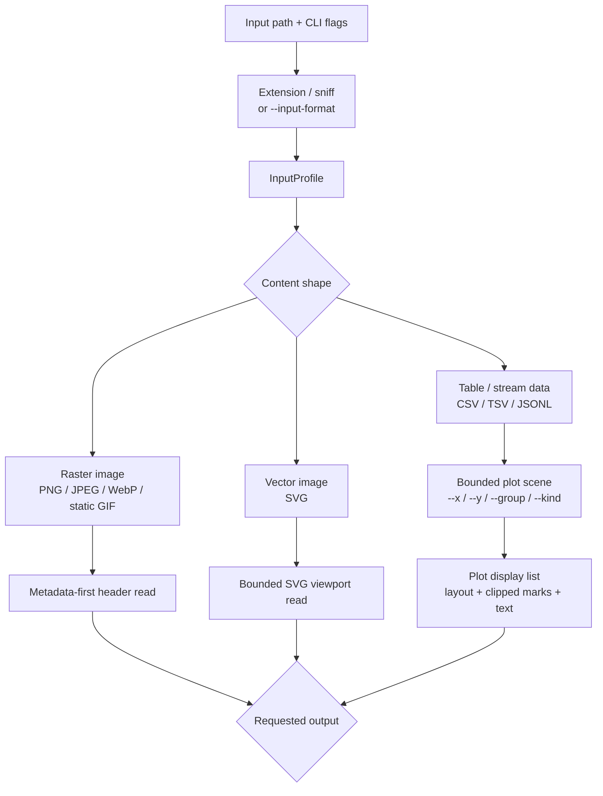
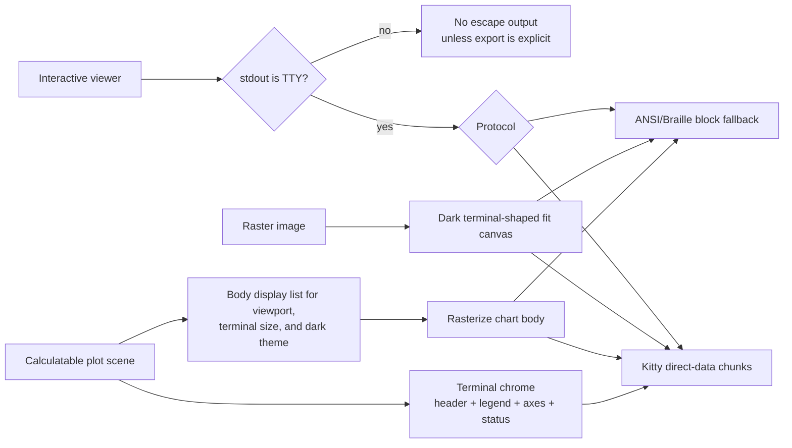
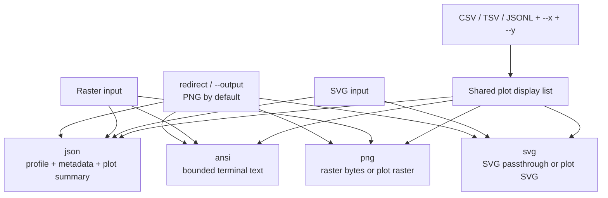

# termviz

Terminal-first viewing for images and plots.

`termviz` opens visual files from a shell, renders them in an interactive
terminal viewer when stdout is a TTY, and keeps redirected stdout scriptable for
metadata and explicit exports.

## Quick Start

Install with Cargo:

```sh
cargo install --git https://github.com/siriusctrl/termviz
```

To install a tagged version:

```sh
cargo install --git https://github.com/siriusctrl/termviz --tag v0.2.2
```

```sh
termviz image.png
termviz image.png --inspect
termviz image.png > frame.png
termviz image.png --output-format ansi > preview.ansi

termviz chart.svg
termviz chart.svg --output-format svg > chart.svg

termviz examples/latency-demo.csv --x time --y latency --group service
termviz examples/latency-demo.csv --x time --y latency --group service > latency.png
termviz examples/latency-demo.csv --x time --y latency --group service --output-format svg > latency.svg
termviz examples/latency-demo.csv --x time --y latency --group service --output-format json > latency.json
```

If stdout is a terminal, the default command opens the viewer. If stdout is
redirected, `termviz` prints metadata or a clear error unless an explicit export
was requested; it does not accidentally dump terminal escape sequences into
scripts.

## Interactive Viewer

Common controls:

- `q`: quit
- `+` / `-`: zoom in and out
- `0`: fit to terminal
- arrow keys: pan
- `m`: toggle metadata or plot summary overlay
- left mouse drag: pan image inputs

Most users do not need to pass `--protocol`. The default is `auto`:

```sh
termviz image.png --protocol auto
```

`auto` uses environment hints to choose the first supported interactive backend
in this order:

```text
Kitty-compatible terminals (Kitty, WezTerm, Ghostty)
-> ANSI blocks fallback
```

Terminal multiplexers such as tmux and screen use blocks only when no known
outer terminal hint is visible. If Kitty, WezTerm, or Ghostty leaves a clear
environment hint, `auto` still selects the Kitty-compatible path. Force a
backend only when you are testing or overriding auto detection:

```sh
termviz image.png --protocol kitty
termviz image.png --protocol blocks
```

Kitty output uses remote-safe direct-data chunks, not local file-transfer
payloads, so it works in SSH, container, and sandboxed sessions where the
terminal process cannot read files from the app filesystem. Normal plot viewer
sizes render at the full terminal pixel estimate; only very large windows cap
the internal plot raster to keep redraws bounded.

The interactive chrome uses real terminal text rather than plot pixels for
viewer UI. Plot headers, legends, axis labels, and the bottom status bar are
drawn as styled terminal text around the image body; pixel protocols only carry
the chart body itself.

## Export Modes

Redirected stdout defaults to PNG, so this writes PNG bytes:

```sh
termviz image.png > frame.png
termviz data.csv --x ts --y value > chart.png
```

Use `--output-format` with shell redirection when you want another scriptable
output format:

- `json`: profile, metadata, and plot summaries
- `ansi`: terminal-cell preview output for raster and plot inputs
- `png`: PNG output for raster inputs and plot scenes
- `svg`: SVG passthrough for SVG inputs and SVG output for plot scenes

```sh
termviz image.png --output-format json > metadata.json
termviz image.png --output-format ansi > frame.ansi
termviz data.csv --x ts --y value --output-format svg > chart.svg
termviz data.csv --x ts --y value --output-format png > chart.png
```

Shell redirection does not expose the target filename to `termviz`, so
`termviz image.png > frame.ansi` still writes PNG unless `--output-format ansi`
is provided.

`--output path` is optional. It asks `termviz` to open the file itself. It
infers the output format from `.json`, `.ansi`, `.ans`, `.png`, or `.svg`; if
the extension is missing or unsupported, it defaults to PNG:

```sh
termviz image.png --output metadata.json
termviz data.csv --x ts --y value --output chart.svg
termviz image.png --output frame
```

Input format is inferred from extension and bounded content sniffing. Use
`--input-format` only when that inference is wrong or impossible:

```sh
termviz metrics.data --input-format csv --x ts --y value
termviz stream.records --input-format jsonl --x ts --y value --output-format svg > chart.svg
```

## Rendering Paths

Every input first resolves to an `InputProfile`. That profile decides whether
the runtime should inspect metadata, build a plot scene, rasterize pixels, or
hand bytes through as an explicit export.



Interactive rendering keeps visual work behind TTY detection and protocol
selection:



Explicit export bypasses the interactive protocol layer:



## Input Behavior

Raster images:

- `--inspect` reads metadata first.
- Interactive viewing is guarded by an 8,000,000 pixel safety threshold.
- Explicit PNG/ANSI exports currently decode the full image before writing.
- Interactive fit mode composites transparent pixels over a dark matte, so
  transparent images do not inherit a bright terminal background.

SVG files:

- `--inspect` reads `width`, `height`, or `viewBox` from a bounded header read.
- `--output-format svg > chart.svg` copies SVG input through unchanged.
- Interactive SVG rasterization is not implemented yet; export or inspect it
  explicitly.

Plot data:

- CSV, TSV, and JSONL are loaded into a bounded plot scene.
- Interactive viewing requires `--x` and `--y`.
- `--group` creates named series.
- `--kind line|scatter` selects the plot style.
- PNG and SVG plot export share the same layout, clipping, axis, legend, and
  visible-series command generation before writing their target format.
- The interactive plot viewer coalesces pending key and resize events before
  drawing, caches unchanged frames, preloads likely next Kitty plot images
  during idle time, and avoids full-screen clears for image protocol frames.
  Background preloads never replace the currently visible frame, so rapid
  zooming and panning keep axis labels and chart body in sync.
- Pixel-protocol plot viewing keeps chart chrome as real terminal text and
  sends only the plot body through the image protocol. This keeps file names,
  legends, axis labels, and controls crisp while reducing image payload size.
  The top chrome carries plot context; the bottom bar stays control-only.

## Examples

Inspect a raster:

```sh
termviz examples/inspect-square.png --inspect
```

Render the same plot three ways:

```sh
termviz examples/latency-demo.csv --x time --y latency --group service
termviz examples/latency-demo.csv --x time --y latency --group service --output-format svg > target/latency.svg
termviz examples/latency-demo.csv --x time --y latency --group service > target/latency.png
```

Force a protocol backend:

```sh
termviz examples/latency-demo.csv --x time --y latency --group service --protocol kitty
termviz examples/latency-demo.csv --x time --y latency --group service --protocol blocks
```

## Development

```sh
cargo fmt --check
cargo test
cargo clippy --all-targets -- -D warnings
```

Performance and visual checks:

```sh
scripts/bench-render-pipeline.sh --quick
scripts/bench-plot-recompute.sh --quick
scripts/bench-plot-e2e.sh --quick
scripts/record-emulator-demo.sh target/termviz-emulator-recordings/demo -- target/debug/termviz examples/latency-demo.csv --x time --y latency --group service
scripts/record-emulator-fixtures.sh target/termviz-emulator-recordings/fixtures
scripts/record-pty-demo.sh target/termviz-recordings/demo -- target/debug/termviz examples/latency-demo.csv --x time --y latency --group service
```

`cargo test` also includes deterministic plot visual signatures for the export
PNG path and the interactive dark PNG path. If a performance change alters the
rendered chart, those tests fail with the new signature so intentional visual
updates can be reviewed and refreshed explicitly.

`scripts/bench-render-pipeline.sh --quick` reports a shared render-pipeline CSV
for plot and image paths across Kitty and Blocks. The columns split profile/load,
layout, display-list, raster/resize, compose, protocol encoding, terminal
chrome, payload bytes, command count, and image pixels. Use it before and after
render changes so performance work can be checked without guessing.

`scripts/bench-plot-recompute.sh --quick` remains a smaller plot hot-path view
for display-list, rasterization, protocol-encoding, payload-byte, command-count,
and image-pixel columns.

Protocol behavior is covered at backend, viewer-frame, selector, and CLI/PTY
layers. See `docs/testing.md` before changing protocol output, and see
`docs/visual-verification.md` before reporting visual changes as complete.
Kitty and other pixel-protocol visual changes need a real emulator recording:
PTY logs prove escape bytes were written, while emulator frames prove the
terminal composited the image.

Maintainer architecture details live in `docs/architecture.md`.
